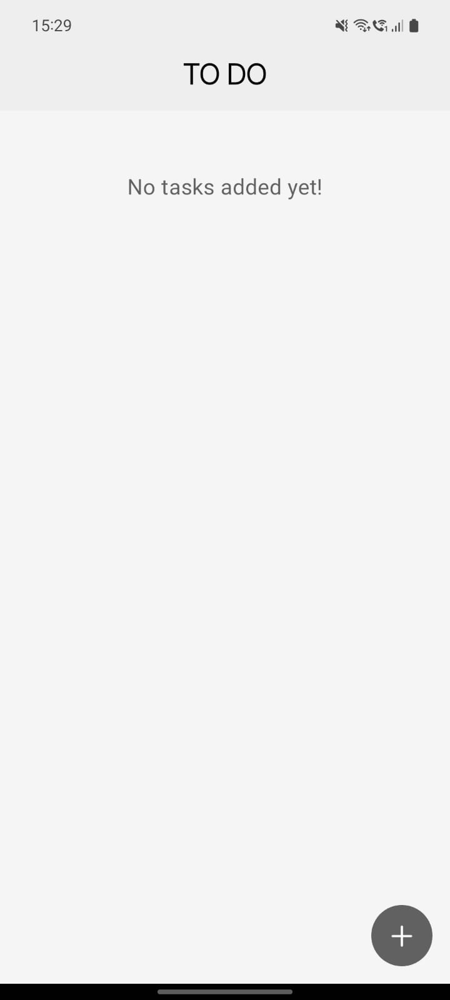
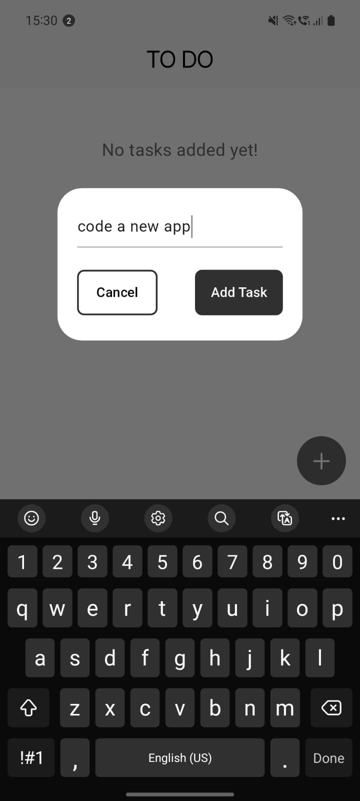
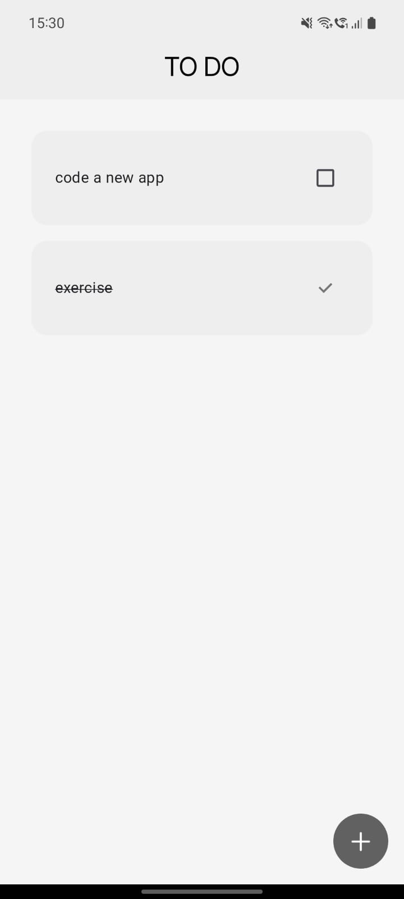
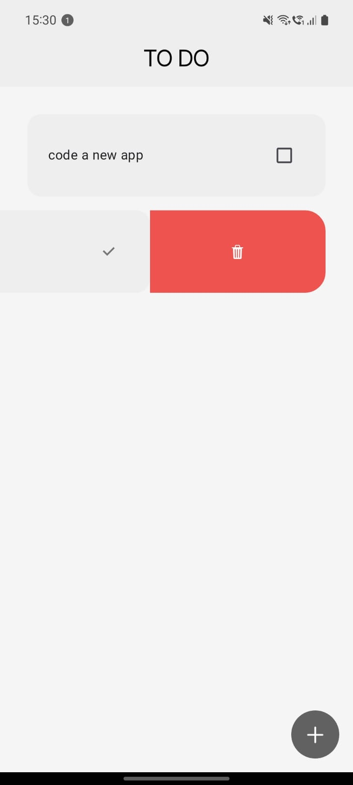

# To-Do App

A simple and intuitive To-Do app built with Flutter that allows users to add, check, and delete tasks efficiently.

## Features

- 📌 **Add Tasks** – Easily add new tasks to your to-do list.
- ✅ **Check Tasks** – Mark tasks as completed.
- ❌ **Delete Tasks** – Remove tasks with a swipe.
- 🎉 **Empty State Message** – Displays a message when no tasks are pending.

## Screenshots

<p>
  
  
  
  
</p>


## Android Release

- For Android users, you can download the APK file from the [Releases](https://github.com/chinni-03/todo_list/releases) section and install it on your device.

If you want to run the app on an emulator or are an iOS user, follow the installation procedure given below.

## Installation

### Prerequisites

Ensure you have Flutter installed on your system.

- [Flutter Installation Guide](https://docs.flutter.dev/get-started/install)

### Clone the Repository

```sh
git clone https://github.com/chinni-03/todo_list.git
cd todo_list
```

### Install Dependencies

```sh
flutter pub get
```

### Run the App

```sh
flutter run
```

## Building for iOS (Mac Users Only)

Since iOS development requires macOS, follow these steps to build the iOS app:

### Prerequisites

- Install Xcode from the Mac App Store.
- Run the following command to accept Xcode's license:
  ```sh
  sudo xcodebuild -license
  ```
- Install CocoaPods if not already installed:
  ```sh
  sudo gem install cocoapods
  ```

### Build the iOS App

1. Navigate to the project directory:
   ```sh
   cd todo_list
   ```
2. Ensure dependencies are up to date:
   ```sh
   flutter pub get
   ```
3. Change to the iOS directory and install CocoaPods dependencies:
   ```sh
   cd ios
   pod install
   cd ..
   ```
4. Build the iOS app:
   ```sh
   flutter build ios --release
   ```
5. Run the app on a connected iPhone or Simulator:
   ```sh
   flutter run
   ```

## Building for Android

To generate an APK for Android, follow these steps:

### Build the APK

```sh
flutter build apk --release
```

The generated APK can be found in `build/app/outputs/flutter-apk/app-release.apk`.

## Usage

1. Open the app.
2. Add a new task by tapping the **"+"** button.
3. Mark tasks as completed by checking the checkbox.
4. Delete tasks by swiping more than 25% to the left.

## Contributing

Contributions are welcome!

1. Fork the repository.
2. Create a new branch:
   ```sh
   git checkout -b feature-branch
   ```
3. Make your changes and commit:
   ```sh
   git commit -m "Added new feature"
   ```
4. Push changes to GitHub:
   ```sh
   git push origin feature-branch
   ```
5. Open a Pull Request.

## License

This project is licensed under the MIT License - see the [LICENSE](LICENSE.md) file for details.

## Contact

For queries, feel free to reach out at [harshinivk12@gmail.com](mailto:harshinivk12@gmail.com).
