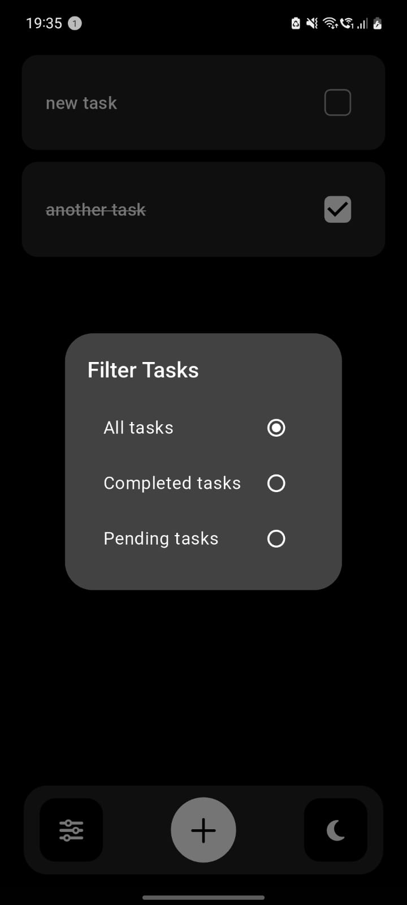

# Remynd: A To-Do App
A simple and efficient To-Do app built with Flutter, allowing users to manage their tasks seamlessly with an improved user experience.

## Features
📌 **Add Tasks** – Quickly add new tasks to your list.  
✅ **Check Tasks** – Mark tasks as completed with ease.  
❌ **Delete Tasks** – Swipe to remove tasks effortlessly.  
🎨 **Dark Mode Support** – Experience a sleek dark mode for better usability.  
📂 **Task Filtering** – Filter tasks based on completion status.  
🎉 **Improved UI & UX** – Enhanced interface for a smoother user experience.

## Screenshots

<p>
  
  
  
  
</p>

<p>
  
  
  
  
</p>

## Android Release
Android users can download the APK file from the **Releases** section and install it on their devices.
If you want to run the app on an emulator or are an iOS user, follow the installation steps below.

## Installation
### Prerequisites
Ensure Flutter is installed on your system.
Follow the [Flutter installation guide](https://flutter.dev/docs/get-started/install) if needed.

### Clone the Repository
```sh
git clone https://github.com/chinni-03/todo_app.git
cd todo_app
```

### Install Dependencies
```sh
flutter pub get
```

### Run the App
```sh
flutter run
```

## Building for iOS (Mac Users Only)
Since iOS development requires macOS, follow these steps:

### Prerequisites
1. Install **Xcode** from the Mac App Store.
2. Accept Xcode's license:
   ```sh
   sudo xcodebuild -license
   ```
3. Install CocoaPods if not already installed:
   ```sh
   sudo gem install cocoapods
   ```

### Build the iOS App
```sh
cd todo_app
flutter pub get
cd ios
pod install
cd ..
flutter build ios --release
flutter run
```

## Building for Android
To generate an APK for Android, run:
```sh
flutter build apk --release
```
The APK will be found at: `build/app/outputs/flutter-apk/app-release.apk`

## Usage
1. Open the app.
2. Add a task by tapping the **+** button.
3. Mark tasks as completed using the checkbox.
4. Delete tasks by swiping more than 25% to the left.
5. Toggle dark mode for a different theme.
6. Filter tasks using the **Filter Tasks** option.

## Contributing
Contributions are welcome!

1. **Fork** the repository.
2. Create a new branch:
   ```sh
   git checkout -b feature-branch
   ```
3. Make your changes and commit:
   ```sh
   git commit -m "Added new feature"
   ```
4. Push changes to GitHub:
   ```sh
   git push origin feature-branch
   ```
5. Open a **Pull Request**.

## License
This project is licensed under the MIT License - see the [LICENSE](LICENSE.md) file for details.

## Contact
For queries, feel free to reach out at **harshinivk12@gmail.com**.

